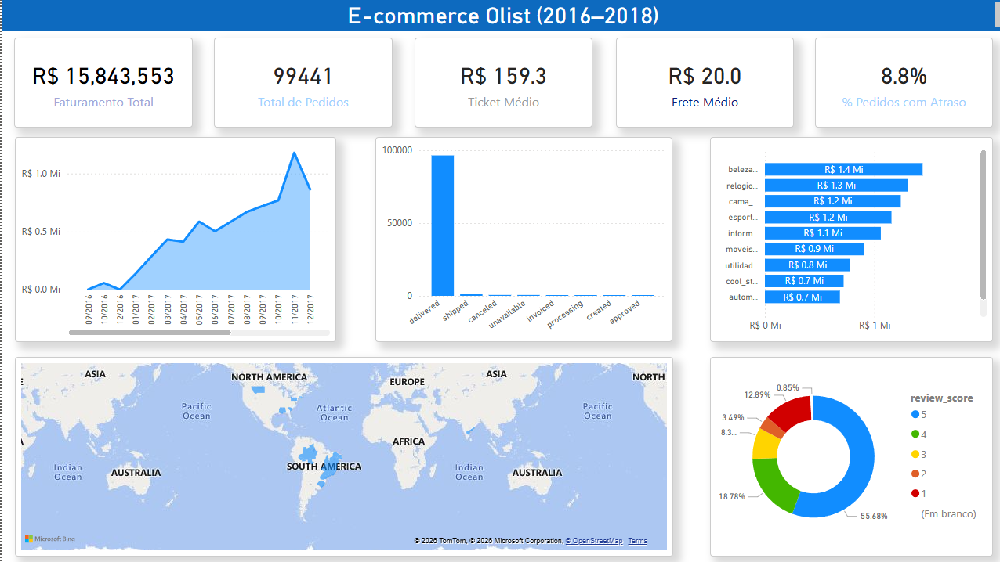

Análise de Dados – E-commerce Brasileiro (Olist)

Projeto completo de análise de dados end-to-end utilizando o dataset público da **Olist**, um dos conjuntos de dados mais utilizados em portfólios de Data Analytics no Brasil. Cobre todo o pipeline: **Python → SQL Server → Power BI**.

---

 Dashboard



---

 Objetivo

Analisar o desempenho de um e-commerce brasileiro com foco em:

- Evolução do faturamento ao longo do tempo
- Performance por categoria de produto
- Experiência e satisfação do cliente
- Qualidade e distribuição dos pedidos

---

 Principais Insights

- **R$ 15,8 milhões** em faturamento total entre 2016 e 2018
- **99.441 pedidos** analisados com ticket médio de **R$ 159**
- **8,8% dos pedidos chegaram com atraso** — dado relevante para estratégia logística
- **Beleza, Relógios e Cama/Mesa/Banho** são as top 3 categorias em faturamento
- **55,68% dos clientes deram nota 5** — alta satisfação geral
- Crescimento acelerado em 2017, com pico em **novembro/2017** (Black Friday)
- A grande maioria dos pedidos tem status **"delivered"** — operação eficiente

---

 Tecnologias Utilizadas

| Ferramenta | Uso |
|---|---|
| Python (Pandas) | Ingestão, limpeza e tratamento dos dados |
| SQL Server (T-SQL) | Modelagem e consultas analíticas |
| Power BI | Dashboard interativo e visualizações |
| Jupyter Notebook | Exploração e análise dos dados |

---

 Dataset

- **Fonte:** Brazilian E-Commerce Public Dataset by Olist
- **Plataforma:** Kaggle
- **Link:** [kaggle.com/datasets/olistbr/brazilian-ecommerce](https://www.kaggle.com/datasets/olistbr/brazilian-ecommerce)
- **Volume:** ~100 mil pedidos entre 2016 e 2018

> ⚠️ Os arquivos de dados não estão incluídos no repositório devido ao tamanho. Faça o download diretamente no Kaggle.

---

 Estrutura do Projeto

```
ecommerce_dataset_olist/
├── E-Commerce_Dataset_by_Olist/
│   ├── python/        → Scripts Python com Pandas
│   ├── sql/           → Queries T-SQL de modelagem e análise
│   ├── powerbi/       → Arquivo .pbix do dashboard
│   └── dados/         → Base de dados (baixar no Kaggle)
├── images/            → Prints do dashboard
└── README.md
```

---

 KPIs do Dashboard

| Métrica | Valor |
|---|---|
| Faturamento Total | R$ 15.843.553 |
| Total de Pedidos | 99.441 |
| Ticket Médio | R$ 159,30 |
| Frete Médio | R$ 20,00 |
| % Pedidos com Atraso | 8,8% |
| Avaliação Média | ⭐ 4+ (55,68% nota 5) |

---

 Visões do Dashboard

- **Visão Geral** — KPIs principais e evolução temporal do faturamento
- **Status dos Pedidos** — distribuição por situação (entregue, cancelado, etc.)
- **Categorias** — ranking de faturamento por categoria de produto
- **Experiência do Cliente** — distribuição de avaliações (review score)
- **Geolocalização** — mapa de distribuição dos pedidos

---

 Diferenciais do Projeto

- Pipeline completo end-to-end: Python → SQL → Power BI
- Dados reais e públicos de e-commerce brasileiro
- Modelagem dimensional com SQL Server
- Foco em métricas de negócio e tomada de decisão
- Análise de experiência do cliente com review score

---

 Autor

**João Pedro Alexandre Soares Bezerra**  
Jovem Aprendiz RH/TI · Neoenergia Pernambuco  

[](https://github.com/joaopedro4250)
[](https://www.linkedin.com/in/joao-pedro-alexandre-145b10351/)
